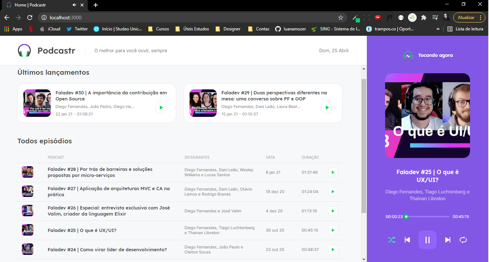
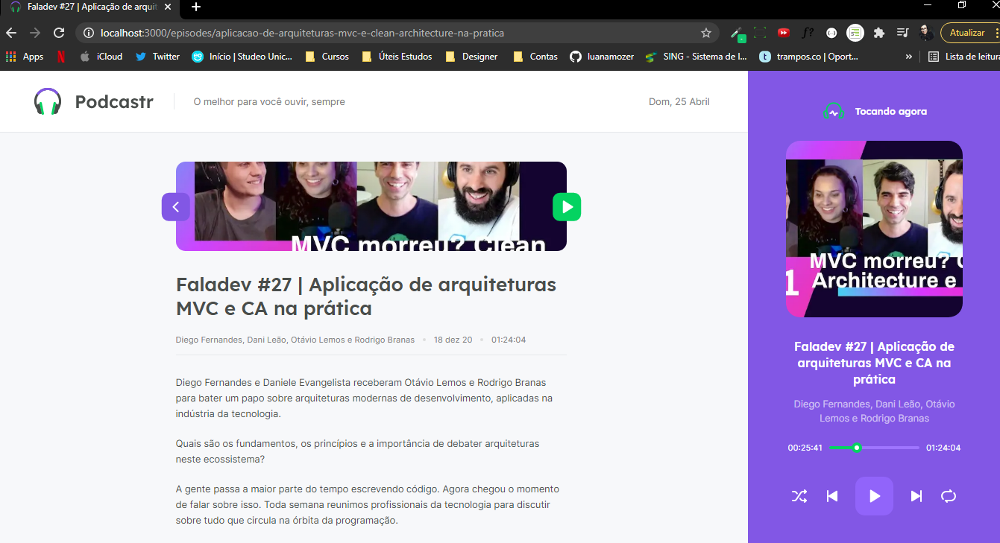

<h1 align="center">
  
</h1>

<h1>

</h1>

## 📋 Sobre

Projeto **Podcastr** é uma aplicação de Podcast desenvolvida na semana **NLW05** trilha ReactJs, com intuito de levar o conhecimento Front-end para o próximo nivel, tendo o maior foco em ReactJs com NextJs.

---

## 🚀 Tecnologias Utilizadas

O projeto foi desenvolvido utilizadndo as seguintes tecnologias :

- ReactJs
- NextJs
- Sass

---

Desenvolvido 💜 por Luana Mozer
